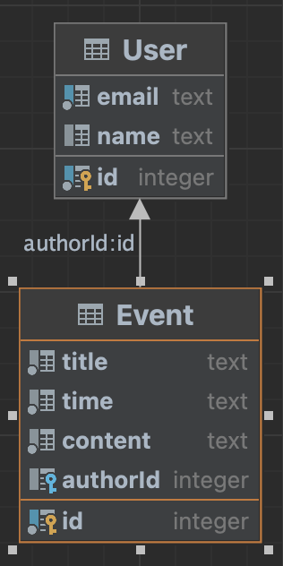

# Родин Андрей Игоревич
___

## Схема данных в виде ERD диаграммы:

## Значение сущностей
- **User** (Сущность _User_):
  - **id** — уникальный идентификатор (_числовой автоинкремент_);
  - **email** — строка с email, должна быть _уникальной_.
- **Event** (Event):
  - **id** — уникальный идентификатор (_числовой автоинкремент_);
  - **title** — заголовок события ;
  - **time** — дата и время проведения события;
  - **content** — содержание;
  - **author** — кто создал мероприятие;
  - **authorId** — id автора;